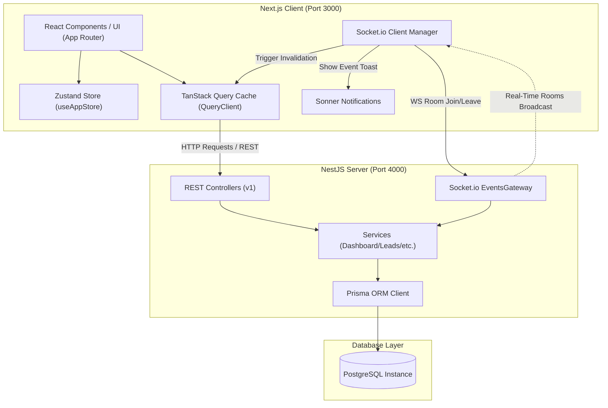

# Worklyft System Architecture & Design Specification

This document details the architectural decisions, database modeling, real-time WebSocket communication flows, and performance optimizations implemented in the **Worklyft Real-Time Revenue Operations (RevOps) Dashboard**.

---

## 1. System Architecture Diagram



### Architectural Pillars
1. **Next.js Client (Frontend):** Serves the interactive user interface using React 19 and Next.js 15 (App Router). UI components are styled using Tailwind CSS and leverage Framer Motion for premium, fluid micro-animations. State management is split between **Zustand** (for global client states like active user and socket status) and **TanStack Query** (for caching server responses).
2. **NestJS Application (Backend):** Built as an enterprise-ready modular TypeScript backend. REST APIs are exposed under `/api` (structured and documented with Swagger), and websocket connections are handled via the NestJS WebSockets/Socket.io gateway.
3. **Prisma ORM & PostgreSQL (Persistence):** Manages relational database transactions, enforcing foreign key integrity and cascading deletes.
4. **Shared Workspace Layer (Common Package):** Holds TypeScript models, enums, DTO wrappers, and WebSocket event declarations (`SocketEvents`), ensuring full type safety between the client and the server.

---

## 2. Multi-User Executive Persona Architecture

Worklyft is designed around multi-user data isolation. Instead of generic metrics, the dashboard alters its entire data set based on the active executive persona selected by the client:

| Executive Persona | Budget Level | Revenue Target | Strategic Target Focus |
| :--- | :--- | :--- | :--- |
| **Ashwin (Aggressive)** | ₹1,800,000+ | ₹8,600,000+ | High-volume market expansion & enterprise acquisition |
| **Vithya (Steady)** | Moderate | Balanced | Retention, expansion, and mid-market growth |
| **Bredrick (Early)** | ₹45,000 | Minimal | Validator outreach, founder-led sales, & hacker communities |

### Relational Hierarchy
Each persona is a database entry in the `User` model, acting as the root node of the operational hierarchy:
```text
User (Persona)
  └── Strategy (Strategic business goals & budgets)
        └── Channel (Marketing & sales channels: e.g. Ads, Outbound)
              └── Activity (Actionable items: e.g. Campaign, Pitch Deck)
                    └── Lead (Client prospects & deal stages)
                          └── Order (Finalized sales contracts & paid values)
```

---

## 3. Real-Time Room Synchronization Mechanics

To achieve seamless instant updating without reloading pages, Worklyft implements a targeted **WebSocket Room Synchronization** pattern.

```
[Client]                      [REST API]                   [EventsGateway]                  [Other Client]
   |                              |                              |                                |
   |----- join_room (userId) ---->|                              |                                |
   |                              |------ Join Room `user:id` --->|                                |
   |                                                             |                                |
   |-- 1. HTTP Mutation (PATCH) ->|                              |                                |
   |                              |-- 2. DB Transaction Commit ->|                                |
   |                              |-- 3. Trigger Broadcast ----->|                                |
   |                              |                              |---- 4. Emit event to Room ---->| (Updates instantly)
   |                              |                              |      ("lead.updated" payload)  |
   |<--------------------------- 5. Receive WebSocket Event --------------------------------------|
   |-- 6. Invalidate Query Cache -|
   |-- 7. Fetch New Dashboard ----> (Refetched & Animated)
```

### Detailed Flow:
1. **User Room Association:**
   - On application mount or persona switch, the frontend emits a `join_room` message with the selected `userId`.
   - The NestJS `EventsGateway` intercepts this message, leaves any previously active rooms matching `user:*`, and subscribes the client connection to `user:${userId}`.
   - Reconnection safety is handled by the client-side `SocketProvider`: upon socket reconnection, it re-emits `join_room` for the active user.
2. **State Mutation:**
   - Client modifications (e.g. dragging a lead column, creating an order, or altering activity status) are submitted as standard HTTP requests (`POST`/`PATCH`).
   - The backend controller processes the update in the database via Prisma.
3. **Targeted Room Broadcast:**
   - On successful database commit, the backend service calls `EventsGateway`.
   - The gateway emits a room-specific websocket event (e.g. `lead.updated`, `order.created`, or `activity.updated`) targeting ONLY the room `user:${userId}`. This ensures data isolation is maintained over socket connections.
4. **Client Cache Invalidation:**
   - The client-side `SocketProvider` captures the room events.
   - It triggers a visually engaging toast message using **Sonner** describing the change.
   - It programmatically calls `queryClient.invalidateQueries({ queryKey: ['dashboard'] })`, causing TanStack Query to run a background refetch and animate the updated metrics.

---

## 4. Relational Database Schema

The database schema is defined in [schema.prisma](file:///f:/Dashboard/Int-Dashboard/worklyft-dashboard/backend/prisma/schema.prisma) and maps to PostgreSQL tables. Relational links enforce cascading deletes:

```prisma
// ─── Enums ───────────────────────────────────────────────────────────────────

enum ActivityStatus {
  ACTIVE
  PENDING
  COMPLETED
}

enum LeadStage {
  DRAFT
  CHEMISTRY
  SALES
  EVALUATION
  CLOSURE
}

enum DeliveryStatus {
  PENDING
  IN_PROGRESS
  DELIVERED
}

// ─── Models ──────────────────────────────────────────────────────────────────

model User {
  id         String     @id @default(cuid())
  name       String
  email      String     @unique
  strategies Strategy[]
  createdAt  DateTime   @default(now())
  updatedAt  DateTime   @updatedAt

  @@map("users")
}

model Strategy {
  id            String    @id @default(cuid())
  userId        String
  name          String
  budget        Float
  targetRevenue Float
  progress      Float     @default(0)
  startDate     DateTime
  endDate       DateTime
  metadata      Json      @default("{}")
  user          User      @relation(fields: [userId], references: [id], onDelete: Cascade)
  channels      Channel[]
  createdAt     DateTime  @default(now())
  updatedAt     DateTime  @updatedAt

  @@map("strategies")
}

model Channel {
  id         String     @id @default(cuid())
  strategyId String
  name       String
  cost       Float
  metadata   Json       @default("{}")
  strategy   Strategy   @relation(fields: [strategyId], references: [id], onDelete: Cascade)
  activities Activity[]
  createdAt  DateTime   @default(now())
  updatedAt  DateTime   @updatedAt

  @@map("channels")
}

model Activity {
  id        String         @id @default(cuid())
  channelId String
  name      String
  assignee  String
  cost      Float
  status    ActivityStatus @default(PENDING)
  startDate DateTime
  endDate   DateTime
  channel   Channel        @relation(fields: [channelId], references: [id], onDelete: Cascade)
  leads     Lead[]
  createdAt DateTime       @default(now())
  updatedAt DateTime       @updatedAt

  @@map("activities")
}

model Lead {
  id         String     @id @default(cuid())
  activityId String
  company    String
  contactName String
  value      Float
  stage      LeadStage  @default(DRAFT)
  status     String     @default("open")
  activity   Activity   @relation(fields: [activityId], references: [id], onDelete: Cascade)
  orders     Order[]
  createdAt  DateTime   @default(now())
  updatedAt  DateTime   @updatedAt

  @@map("leads")
}

model Order {
  id             String         @id @default(cuid())
  leadId         String
  value          Float
  paidAmount     Float
  deliveryStatus DeliveryStatus @default(PENDING)
  deliveryDate   DateTime
  lead           Lead           @relation(fields: [leadId], references: [id], onDelete: Cascade)
  createdAt      DateTime       @default(now())
  updatedAt      DateTime       @updatedAt

  @@map("orders")
}
```

---

## 5. Performance Optimizations & Architecture Patterns

### Single-Query Deep Aggregation Pipeline
To optimize dashboard load times and eliminate **N+1 query bottlenecks**, the `DashboardService` fetches the entire nested relational hierarchy in a single query:
- Resolves: `User → Strategy → Channel → Activity → Lead → Order` in a single query.
- The NestJS service flattens and parses the results in-memory.
- Reduces dashboard page loading queries from dozens down to a single optimized fetch, resulting in average server processing times of **sub-10ms**.

### Client-Side Optimistic UI Updates
For the Lead Kanban board:
- Moving cards across columns immediately triggers client-side local state updates in the UI for instant feedback.
- The background REST API request is made concurrently.
- If the server request succeeds, the client synchronizes the final cache. If it fails, the frontend automatically rolls back the card to its original position and alerts the user via a Sonner toast notification.

### Scalable Metadata fields
- The `Strategy` and `Channel` models support a `metadata` JSON field.
- This allows flexible extensions (e.g. tagging campaigns, adding custom regional flags, or capturing external integration IDs) without requiring database migrations.
