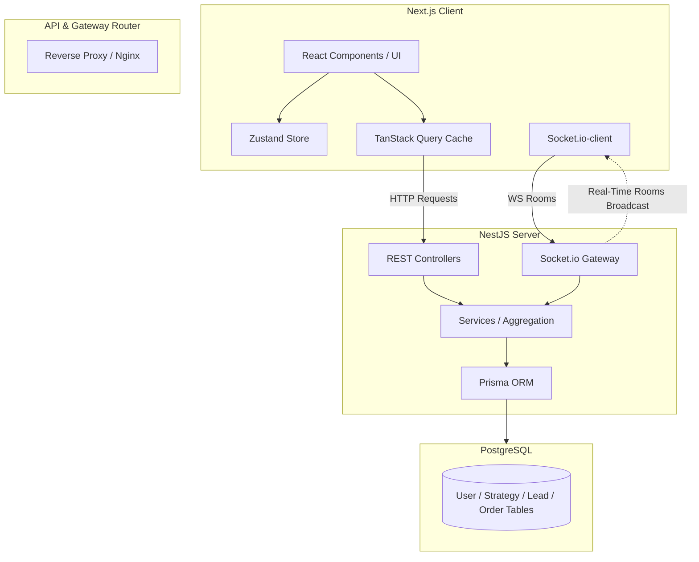

# System Architecture & Design Specification

This document details the architectural decisions, database modeling, real-time WebSocket communication flows, and performance optimizations implemented in the Worklyft Real-Time Revenue Operations Dashboard.

---

## 1. System Architecture Diagram



---

## 2. Real-Time Synchronization Flow

Worklyft utilizes a **pub/sub style room synchronization pattern** using Socket.io to achieve localized real-time updates:

1. **Room Association:**
   - When the user selects or switches to an executive persona, the client emits a `join_room` event with the `userId` payload.
   - The NestJS WebSocket Gateway intercepts this and joins the client socket to a room named after the specific `userId`.
   - If the user switches personas, they emit `leave_room` for the old ID and `join_room` for the new ID.

2. **Mutation & Broadcast Trigger:**
   - Any transaction that changes dashboard state (e.g. advancing a lead stage on the Kanban board, toggling a marketing activity status, committing an order) is submitted via a REST POST/PATCH request to the backend.
   - The REST controller processes the state change in the database.
   - Upon successful database commit, the controller calls the `EventsGateway` to emit a specific event (e.g., `lead.updated`, `order.created`, `activity.updated`) specifically to the user's room.

3. **Client-Side Refetching:**
   - The frontend `SocketProvider` listens for these events.
   - When an event is received, it triggers a custom visual toast notification using `sonner` (e.g. "Lead for Stripe advanced to closure stage!").
   - It programmatically calls `queryClient.invalidateQueries({ queryKey: ['dashboard', activeUserId] })`.
   - TanStack Query automatically refetches the dashboard dataset, updating all charts and grids smoothly.

---

## 3. Database Schema

The database is built on PostgreSQL. The schema supports strict relational integrity and cascading deletes:

```prisma
model User {
  id         String     @id @default(cuid())
  name       String
  email      String     @unique
  strategies Strategy[]
  createdAt  DateTime   @default(now())
  updatedAt  DateTime   @updatedAt
}

model Strategy {
  id            String    @id @default(cuid())
  userId        String
  name          String
  budget        Float
  targetRevenue Float
  progress      Float     @default(0)
  startDate     DateTime
  endDate       DateTime
  metadata      Json      @default("{}")
  user          User      @relation(fields: [userId], references: [id], onDelete: Cascade)
  channels      Channel[]
}

model Channel {
  id         String     @id @default(cuid())
  strategyId String
  name       String
  cost       Float
  metadata   Json       @default("{}")
  strategy   Strategy   @relation(fields: [strategyId], references: [id], onDelete: Cascade)
  activities Activity[]
}

model Activity {
  id        String         @id @default(cuid())
  channelId String
  name      String
  assignee  String
  cost      Float
  status    ActivityStatus @default(PENDING)
  startDate DateTime
  endDate   DateTime
  channel   Channel        @relation(fields: [channelId], references: [id], onDelete: Cascade)
  leads     Lead[]
}

model Lead {
  id         String     @id @default(cuid())
  activityId String
  company    String
  contactName String
  value      Float
  stage      LeadStage  @default(DRAFT)
  status     String     @default("open")
  activity   Activity   @relation(fields: [activityId], references: [id], onDelete: Cascade)
  orders     Order[]
}

model Order {
  id             String         @id @default(cuid())
  leadId         String
  value          Float
  paidAmount     Float
  deliveryStatus DeliveryStatus @default(PENDING)
  deliveryDate   DateTime
  lead           Lead           @relation(fields: [leadId], references: [id], onDelete: Cascade)
}
```

---

## 4. Performance Optimizations

### Optimized Single-Query Aggregation
To prevent the common **N+1 query problem** when rendering complex dashboard components, `DashboardService` implements an optimized deep join using Prisma:
- The entire hierarchy (`Strategy → Channel → Activity → Lead → Order`) is resolved in a single Prisma query.
- The NestJS service flattens and groups this structure in-memory on the server.
- This results in a massive response time reduction (often sub-10ms) compared to executing individual REST calls for strategies, activities, leads, and orders.

### Optimistic UI Updates
For the lead Kanban board, waiting for network roundtrips during drag-and-drop actions can feel sluggish.
- When a card is dragged and dropped, the client immediately updates the local React state, advancing the card's column.
- The mutation is dispatched in the background.
- If the server succeeds, the cache is updated. If the server fails, a toast is shown, and the board seamlessly rolls back to its previous state.
